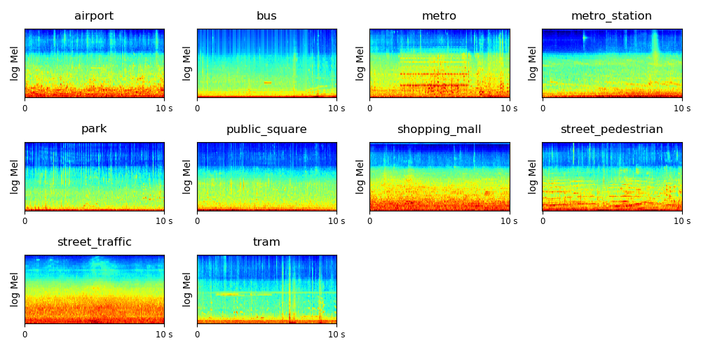

# DCASE 2018 Task 1 Acoustic Scene Classification

DCASE 2018 Task 1 acoustic scene classification is a challenge to classifiy a 10 second audio clip to one of 10 classes such as 'airport', 'urban park', etc. We provide a convolutional neural network (CNN) baseline system implemented with PyTorch in this code base. More details about this challenge can be found http://dcase.community/challenge2018/task-acoustic-scene-classification

## DATASET

The dataset is downloadable from http://dcase.community/challenge2018/task-acoustic-scene-classification

The dataset contains 10 classes of audio scenes, recorded with Device A, B and C. The statistic of the data is shown below:

|           |         Attributes        |                    Dev.                    | Test |
|:---------:|:-------------------------:|:------------------------------------------:|:----:|
| Subtask A | Binanural, 48 kHz, 24 bit |               Device A: 8640               | 1200 |
| Subtask B |       Mono, 44.1 kHz      | Device A: 8640 Device B: 720 Device C: 720 | 2400 |
| Subtask C |             -             |                  Any data                  | 1200 |

The log mel spectrogram of the scenes are shown below:

## Run the code
**0. Prepare data.** download and upzip data, the data looks like:
<pre>
.
├── TUT-urban-acoustic-scenes-2018-development
│    ├── audio (8640 audios)
│    │     └── ...
│    ├── evaluation_setup
│    │     └── ...
│    ├── meta.csv
│    └── ...
├── TUT-urban-acoustic-scenes-2018-evaluation
│    ├── audio (3600 audios)
│    │     └── ...
│    ├── evaluation_setup
│    │     └── ...
│    ├── meta.csv
│    └── ...
├── TUT-urban-acoustic-scenes-2018-leaderboard
│    ├── audio (1200 audios)
│    │     └── ...
│    ├── evaluation_setup
│    │     └── ...
│    ├── meta.csv
│    └── ...
├── TUT-urban-acoustic-scenes-2018-mobile-development
│    ├── audio (10080 audios)
│    │     └── ...
│    ├── evaluation_setup
│    │     └── ...
│    ├── meta.csv
│    └── ...
├── TUT-urban-acoustic-scenes-2018-mobile-evaluation
│    ├── audio (15120 audios)
│    │     └── ...
│    ├── evaluation_setup
│    │     └── ...
│    ├── meta.csv
│    └── ...
└── TUT-urban-acoustic-scenes-2018-mobile-leaderboard
     ├── audio (2400 audios)
     │     └── ...
     ├── evaluation_setup
     │     └── ...
     ├── meta.csv
     └── ...
</pre>

**1. (Optional) Install dependent packages.** If you are using conda, simply run:

$ BACKEND="pytorch"

$ conda env create -f $BACKEND/environment.yml

$ conda activate py3_dcase2018_task1

(We developed this system with python 3. If you are using pytorch as backend then pytorch 0.4.0 is required.)

**2. Then simply run:**

$ ./runme.sh

Or run the commands in runme.sh line by line, including: 

(1) Modify the paths of data and your workspace

(2) Extract features

(3) Train model

(4) Evaluation

The training looks like:

<pre>
Loading data time: 19.000 s
Split development data to 6122 training and 2518 validation data. 
Number of train audios in specific devices ['a']: 6122
tr_acc: 0.100, tr_loss: 6.437
Number of validate audios in specific devices ['a']: 2518
va_acc: 0.100, va_loss: 6.378
iteration: 0, train time: 0.118 s, validate time: 9.518 s
------------------------------------
Number of train audios in specific devices ['a']: 6122
tr_acc: 0.737, tr_loss: 0.709
Number of validate audios in specific devices ['a']: 2518
va_acc: 0.572, va_loss: 1.222
iteration: 100, train time: 21.682 s, validate time: 8.385 s
------------------------------------
......
------------------------------------
Number of train audios in specific devices ['a']: 6122
tr_acc: 1.000, tr_loss: 0.000
Number of validate audios in specific devices ['a']: 2518
va_acc: 0.680, va_loss: 1.347
iteration: 5000, train time: 23.928 s, validate time: 8.553 s
------------------------------------
......
</pre>

## Result

We use the provided training & validation split of the development data. We apply a convolutional neural network on the log mel spectrogram feature to solve this task. Training takes around 100 ms / iteration on a GTX Titan X GPU. The model is trained for 5000 iterations. The result is shown below. 

### Subtask A

Averaged accuracy over 10 classes:

|                   | Device A |
|:-----------------:|:--------:|
| averaged accuracy |   68.0%  |

Confusion matrix:

### Subtask B

Averaged accuracy over 10 classes of device A, B and C:

|                   | Device A | Device B | Device C |
|:-----------------:|:--------:|----------|----------|
| averaged accuracy |   67.9%  | 61.7%    | 57.2%    |

Confusion matrix:

## Summary
This codebase provides a convolutional neural network (CNN) for DCASE 2018 challenge Task 1. 

## Cite
"Kong, Qiuqiang, Turab Iqbal, Yong Xu, Wenwu Wang, and Mark D. Plumbley. "DCASE 2018 Challenge baseline with convolutional neural networks." arXiv preprint arXiv:1808.00773 (2018)."

## FAQ
If you met running out of GPU memory error, then try reduce batch_size. 

## External link

The official baseline system implemented using Keras can be found https://github.com/DCASE-REPO/dcase2018_baseline
